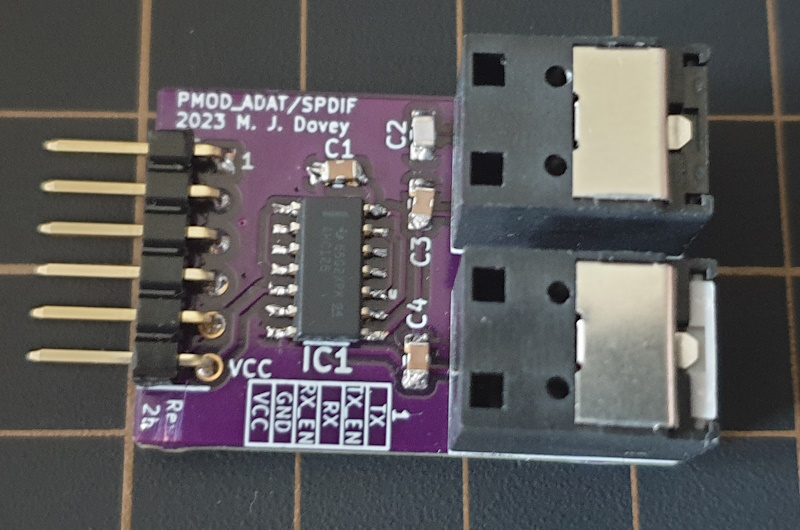

# pmod_optical
#### PMOD to Optical (ADAT/SPDIF) Module

PMOD module for interfacing with optical fibres using the JIS F05 connector (up to 16mbps). Typical applications are for digital audio using SPDIF (2 Channel) or ADAT (4/8 Channels).

| PMOD Pin | Name  | Direction | Description                    |
| -------- | ----- | --------- | ------------------------------ |
| 1        | TX    | Out       | Optical transmitter data       |
| 2        | TX_EN | Out       | Enable the optical transmitter |
| 3        | RX    | In        | Optical receiver data          |
| 4        | RX_EN | Out       | Enable the optical receiver    |

